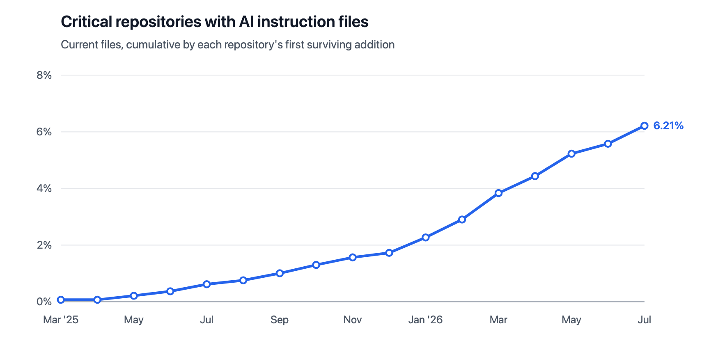
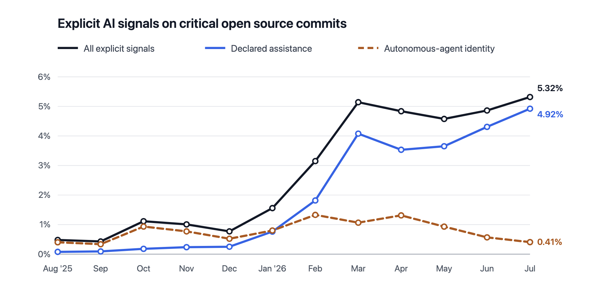

# Use Composition

**Question:** What AI tools, models, and ownership structures are in use across a community's spaces.

This metric is part of the [AI Alignment - Community Governed Use](../ai-alignment-community-governed-use/metric-model-ai-alignment-community-governed-use.md) metrics mode.

## Overview

- Tool Types in Use: category level: assistant, notetaker, autonomous agent, moderation bot, etc.
- Specific Tools in Use: named products: Copilot, ChatGPT, Claude, etc.
- Model Type: underlying model/family, openness
- AI Tool Owner: who controls the tool and its data

## Want to Know More?

### Data Collection Strategies

- Bot/agent identity in workflows: account identity, signed commits, workflow YAML, integration manifests. Detectable today: yes.
- Tool/model identification: self-report, known signatures. Detectable today: partial, known signatures only.
- Environmental footprint disclosure: model/system cards, provider ESG reports. Detectable today: partial, only where publicly disclosed.
- Ownership: provider terms of service, public corporate records, self-report. Detectable today: partial.
- Resource use relative to community size: CI/CD and storage volume compared to contributor count. Detectable today: partial, requires platform-level usage data.

### Filters

- Signals (declared, autonomous, all)

### Visualizations

- A stacked bar chart that shows how much each type of AI tool is used in the community.

[Thanks to Andrew from Ecosyste.ms](https://ecosyste.ms/)

[Thanks to Andrew from Ecosyste.ms](https://ecosyste.ms/)

## References

- [Ecosyste.ms](https://ecosyste.ms/)

## Contributors

- Emma Irwin
- Adrian Edwards
- Justin Wheeler
- Coraline Ada Ehmke
- Omkar Petkar
- Andrew Nesbitt

Add your name if you have contributed

## Additional Information

To edit this metric please submit a Change Request here: (replace with correct link)

To reference this metric in software or publications please use this stable URL: (replace with permalink)
